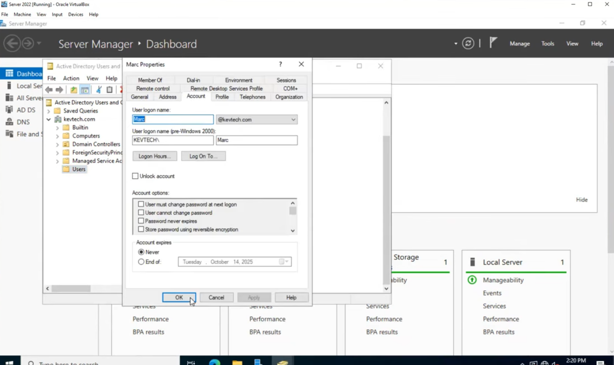
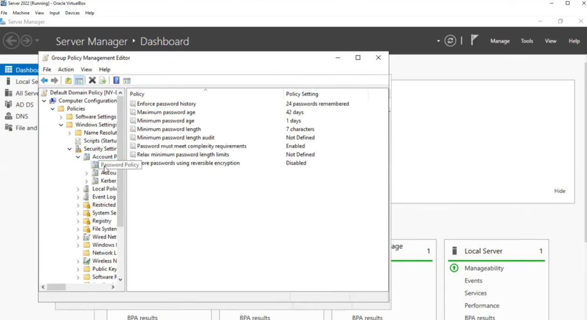
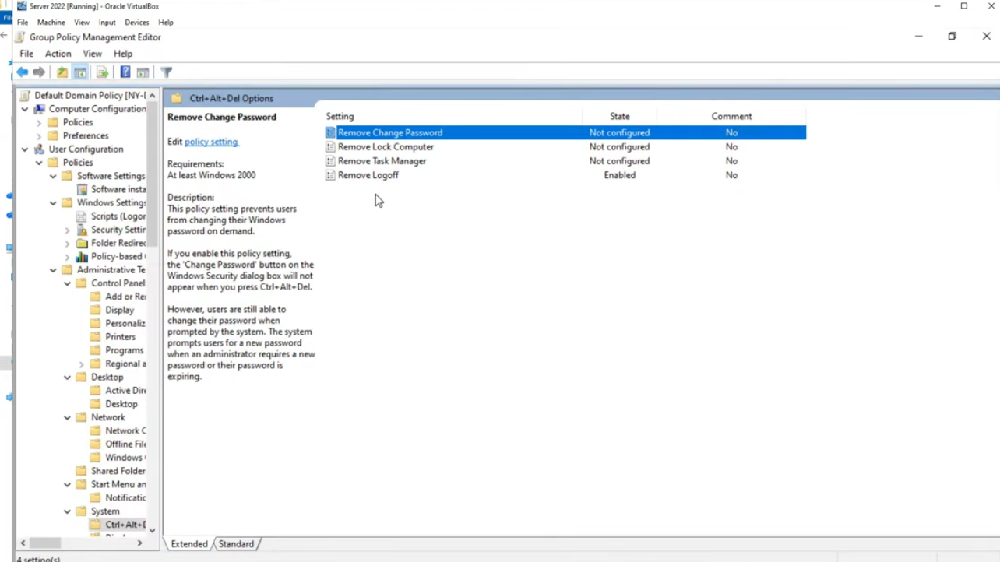
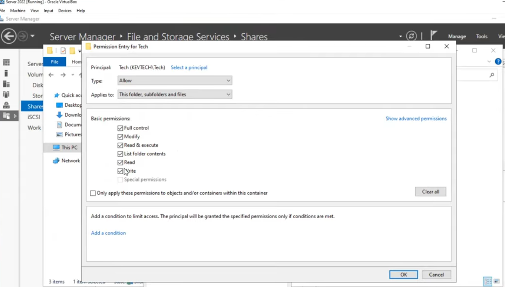

# Identity & Access Management (IAM) Lab

**Platform:** Windows Server 2022 | Active Directory | PowerShell | Group Policy
**Environment:** Virtualized enterprise simulation (Oracle VirtualBox)

---

## Overview

This lab simulates a real-world enterprise IAM environment built on Windows Server 2022 and Active Directory. The objective was to replicate the day-to-day responsibilities of a systems/IAM administrator — handling user lifecycle management, enforcing security policies through Group Policy Objects (GPOs), managing file share permissions, and automating repetitive provisioning tasks with PowerShell.

The lab processed **50+ simulated helpdesk tickets** following ITIL-aligned practices, covering everything from new hire onboarding to access auditing.

Credit to Kevtech on Youtube
---

## Lab Environment

| Component | Detail |
|---|---|
| Hypervisor | Oracle VirtualBox |
| Server OS | Windows Server 2022 (Domain Controller) |
| Services | Active Directory Domain Services (AD DS), DNS, Group Policy, File & Storage Services |

---

## Key Objectives & Outcomes

### 1. User Lifecycle Management
- Provisioned and de-provisioned user accounts in Active Directory Users and Computers (ADUC)
- Performed password resets and resolved account lockouts across 50+ simulated tickets
- Managed group memberships to enforce role-based access control (RBAC)

**Screenshot — Account Unlock (ADUC):**
Resolving a locked-out user account (`Marc`) via the Account tab in user properties.



---

### 2. Group Policy Object (GPO) Configuration

Designed and enforced GPOs at the domain level to establish security baselines aligned with least-privilege principles.

**Password Policy GPO:**

| Setting | Value |
|---|---|
| Enforce password history | 24 passwords remembered |
| Maximum password age | 42 days |
| Minimum password length | 7 characters |
| Password complexity requirements | Enabled |
| Store passwords using reversible encryption | Disabled |

**Screenshot — Password Policy (Group Policy Management Editor):**



---

**Ctrl+Alt+Del / Interactive Logon Policy:**
Configured interactive logon restrictions to prevent unauthorized access vectors (e.g., disabling "Remove Change Password" and "Remove Lock Computer" options).

**Screenshot — Interactive Logon GPO:**



---

### 3. File Share Permissions & Access Control

Configured NTFS and share-level permissions on the file server to enforce the principle of least privilege. Applied granular permission entries scoped to specific security groups.

**Example — Tech Group Share Permissions:**

| Permission | Granted |
|---|---|
| Full Control | Yes |
| Modify | Yes |
| Read & Execute | Yes |
| List Folder Contents | Yes |
| Read | Yes |
| Write | Yes |
| Applies To | This folder, subfolders and files |

**Screenshot — File Share Permission Entry:**



---

### 4. PowerShell Automation

Developed PowerShell scripts to eliminate manual, repetitive tasks — reducing provisioning effort by an estimated **70%**.

**Scripts included in this repo:**

| Script | Purpose |
|---|---|
| [`scripts/bulk-user-provisioning.ps1`](scripts/bulk-user-provisioning.ps1) | Bulk-creates AD users from a CSV file, assigns group memberships, sets initial passwords, and forces password change at next logon |
| [`scripts/access-audit.ps1`](scripts/access-audit.ps1) | Audits all AD users, reports group memberships, last logon timestamps, and flags stale/disabled accounts |

**Sample usage:**
```powershell
# Provision users from CSV
.\scripts\bulk-user-provisioning.ps1 -CsvPath ".\users.csv" -DefaultOU "OU=Staff,DC=kavtech,DC=com"

# Run access audit and export to CSV
.\scripts\access-audit.ps1 -ExportPath ".\audit-report.csv"
```

---

## ITIL-Aligned Ticket Workflow

Each simulated task was treated as a helpdesk ticket following ITIL service management practices:

| Ticket Type | Example Action |
|---|---|
| Access Request | Create new user, assign to appropriate security group |
| Incident | Unlock locked-out account, reset forgotten password |
| Change Request | Modify GPO settings, update group membership |
| De-provisioning | Disable account, remove group memberships, archive home folder |
| Audit | Generate access report, identify stale accounts |

---

## Security Principles Applied

- **Least Privilege** — Users granted only the permissions required for their role
- **Separation of Duties** — Admin accounts separate from standard user accounts
- **Password Hygiene** — Complexity, history, and expiry enforced via GPO
- **Account Lifecycle** — Timely de-provisioning of departed users to reduce attack surface
- **Auditing** — Regular access reviews to detect privilege creep

---

## Skills Demonstrated

- Active Directory administration (ADUC, ADSS)
- Group Policy creation, linking, and enforcement
- NTFS and share permission management
- PowerShell scripting for AD automation
- ITIL-aligned incident and request handling
- Virtualization with Oracle VirtualBox
- Windows Server 2022 configuration and management
